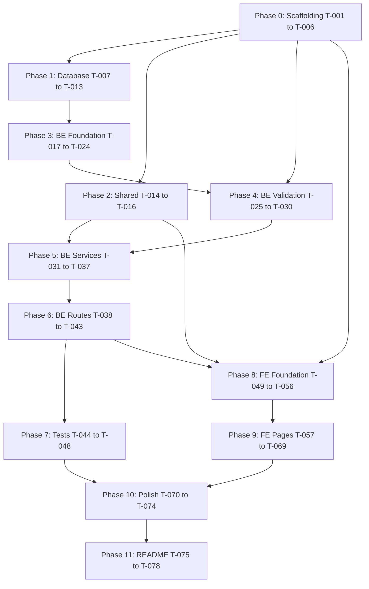

# Implementation Tasks: Support Ticket Management System

Tasks are scoped to **15–30 minutes** each, ordered for sequential execution within phases. Dependencies use task IDs (e.g. `T-012`).

**Categories:** `DB` Database · `BE` Backend · `FE` Frontend · `TEST` Testing · `SETUP` Project setup (treated as setup, not a separate column)

**Estimated total:** ~52 tasks · ~20–26 hours

---

## Phase 0: Project Scaffolding

| ID | Task | Type | Est. | Depends On | Description |
|----|------|------|------|------------|-------------|
| T-001 | Initialize monorepo root | SETUP | 20m | — | Create root `package.json` with npm/pnpm workspaces pointing to `backend`, `frontend`, `packages/shared`. Add root `.gitignore` (node_modules, .env, .next, dist). |
| T-002 | Scaffold `packages/shared` | SETUP | 20m | T-001 | Add `package.json`, `tsconfig.json`, `src/index.ts` barrel export. Configure workspace name `@ticket-mgmt/shared`. |
| T-003 | Scaffold Express backend | SETUP | 25m | T-001 | Initialize `backend/` with TypeScript, Express, dev dependencies (tsx, vitest, supertest, zod, prisma). Add `tsconfig.json`, `src/` folder structure, `npm run dev` script. |
| T-004 | Scaffold Next.js frontend | SETUP | 25m | T-001 | Create `frontend/` with Next.js App Router, TypeScript, `src/` directory. Add dependency on `@ticket-mgmt/shared`. Verify `npm run dev` starts on port 3000. |
| T-005 | Create environment templates | SETUP | 15m | T-003, T-004 | Add `backend/.env.example`, `frontend/.env.local.example`, root `.env.example` with placeholder `DATABASE_URL`, `PORT`, `CORS_ORIGIN`, `NEXT_PUBLIC_API_URL`. Ensure `.env` files are gitignored. |
| T-006 | Wire shared package into BE and FE | SETUP | 20m | T-002, T-003, T-004 | Confirm both apps resolve `@ticket-mgmt/shared` imports. Add build/watch strategy (TypeScript project references or direct src import). |

---

## Phase 1: Database

| ID | Task | Type | Est. | Depends On | Description |
|----|------|------|------|------------|-------------|
| T-007 | Define Prisma enums | DB | 20m | T-003 | In `schema.prisma`, add `UserRole`, `TicketPriority`, `TicketStatus` enums per spec. |
| T-008 | Define `User` model | DB | 15m | T-007 | Add `User` model with UUID id, name, email (unique), role, timestamps. |
| T-009 | Define `Ticket` model | DB | 25m | T-008 | Add `Ticket` model with all fields, FK relations to User (`createdBy`, `assignedTo`), default status `OPEN`, indexes on status/assignedTo/createdAt. |
| T-010 | Define `Comment` model | DB | 20m | T-009 | Add `Comment` model with ticket FK (cascade delete), createdBy FK (restrict), composite index on ticketId + createdAt. |
| T-011 | Run initial migration | DB | 20m | T-010 | Create PostgreSQL database locally. Run `prisma migrate dev` to generate and apply initial migration. Verify tables in DB. |
| T-012 | Write user seed script | DB | 25m | T-011 | Implement `prisma/seed.ts` with 4–5 users (mixed AGENT/ADMIN roles). Register seed command in `package.json`. Run and verify. |
| T-013 | Add optional sample ticket seed | DB | 20m | T-012 | Extend seed with 3–5 tickets in varied statuses and 2–3 comments. Keep optional — document that state-machine tests create their own data. |

---

## Phase 2: Shared Package

| ID | Task | Type | Est. | Depends On | Description |
|----|------|------|------|------------|-------------|
| T-014 | Export enums from shared | SETUP | 15m | T-007, T-002 | Mirror `TicketStatus`, `TicketPriority`, `UserRole` as TypeScript enums/constants in `packages/shared/src/enums.ts`. |
| T-015 | Implement status transition map | SETUP | 25m | T-014 | Add `ALLOWED_TRANSITIONS`, `getAllowedTransitions()`, `canTransition()` in `status-machine.ts`. Cover all valid/terminal states per spec §6. |
| T-016 | Define shared DTO types | SETUP | 20m | T-014 | Add TypeScript interfaces for `UserSummary`, `UserRef`, `TicketListItem`, `TicketDetail`, `Comment`, `ApiError` in `types.ts`. Export from `index.ts`. |

---

## Phase 3: Backend Foundation

| ID | Task | Type | Est. | Depends On | Description |
|----|------|------|------|------------|-------------|
| T-017 | Environment config module | BE | 20m | T-003, T-005 | Create `config/env.ts` to load and validate `DATABASE_URL`, `PORT`, `CORS_ORIGIN`, `NODE_ENV` with Zod. Fail fast on missing vars. |
| T-018 | Prisma client singleton | BE | 15m | T-011, T-017 | Create `lib/prisma.ts` with singleton pattern and dev hot-reload guard. |
| T-019 | AppError class | BE | 20m | T-003 | Define `AppError` with `statusCode`, `code`, `message`, `details?`. Add error code constants matching spec §3.2. |
| T-020 | Error handler middleware | BE | 25m | T-019 | Implement `middleware/error-handler.ts`: map `AppError`, Zod errors, Prisma P2025/P2003 to spec error JSON shape. Hide stack traces from responses. |
| T-021 | Not-found middleware | BE | 15m | T-003 | Return `404 NOT_FOUND` for unmatched API routes. |
| T-022 | Zod validation middleware | BE | 20m | T-003 | Create reusable `validate(schema)` middleware for body, query, and params. |
| T-023 | Express app factory | BE | 25m | T-017, T-020, T-021 | Build `app.ts`: CORS, `express.json()`, route mounting at `/api/v1`, not-found, error handler. Export app without `listen()`. |
| T-024 | Server entry point | BE | 15m | T-023 | Create `index.ts` that starts server on `PORT`. Verify `GET /health` placeholder responds. |

---

## Phase 4: Backend Validation Schemas

| ID | Task | Type | Est. | Depends On | Description |
|----|------|------|------|------------|-------------|
| T-025 | UUID param schema | BE | 15m | T-022 | Add `common.validator.ts` with UUID param schema for `:id` routes. |
| T-026 | Ticket create schema | BE | 20m | T-014, T-022 | Validate title, description, priority, createdById, optional assignedToId per spec §4.2. Strip/ignore status if sent. |
| T-027 | Ticket update schema | BE | 20m | T-026 | Validate partial update fields; reject body containing `status`; require at least one field. |
| T-028 | Status transition schema | BE | 15m | T-014, T-022 | Validate `status` is valid `TicketStatus` enum. |
| T-029 | Comment create schema | BE | 15m | T-022 | Validate message and createdById per spec §4.5. |
| T-030 | Ticket list query schema | BE | 15m | T-014, T-022 | Validate optional `search` (max 200) and `status` enum for `GET /tickets`. |

---

## Phase 5: Backend Services

| ID | Task | Type | Est. | Depends On | Description |
|----|------|------|------|------------|-------------|
| T-031 | User service | BE | 20m | T-018 | `listUsers()`, `getUserById()` with Prisma. Throw `NOT_FOUND` when appropriate. |
| T-032 | Ticket service — create | BE | 25m | T-018, T-031 | Create ticket with status `OPEN`, validate FKs, set timestamps. Return ticket with embedded user refs. |
| T-033 | Ticket service — get by ID | BE | 25m | T-018 | Fetch ticket with assignee, creator, comments (ordered by createdAt ASC) and comment authors. |
| T-034 | Ticket service — list with search/filter | BE | 30m | T-018 | Implement `GET /tickets` logic: case-insensitive ILIKE on title/description, optional status filter, AND logic, order by createdAt DESC. |
| T-035 | Ticket service — update fields | BE | 25m | T-033 | Update title, description, priority, assignedToId (nullable). Refresh `updatedAt`. Reject status in payload at controller level. |
| T-036 | Comment service — create | BE | 20m | T-033, T-031 | Add comment to existing ticket; validate ticket and user exist. Return comment with author ref. |
| T-037 | Ticket status service | BE | 30m | T-015, T-033 | Implement `getAllowedTransitions`, `canTransition`, `transitionTicket` using shared map. Throw `INVALID_STATUS_TRANSITION` with allowed targets in message. Single Prisma update. |

---

## Phase 6: Backend Routes & Controllers

| ID | Task | Type | Est. | Depends On | Description |
|----|------|------|------|------------|-------------|
| T-038 | User routes and controller | BE | 20m | T-031, T-023, T-025 | `GET /users`, `GET /users/:id`. Return spec envelope `{ data, meta? }`. |
| T-039 | Ticket routes — list and create | BE | 25m | T-032, T-034, T-026, T-030 | `GET /tickets`, `POST /tickets` (201). Wire validation middleware. |
| T-040 | Ticket routes — get and update | BE | 25m | T-033, T-035, T-027 | `GET /tickets/:id`, `PATCH /tickets/:id`. Reject status field in PATCH body. |
| T-041 | Ticket route — status transition | BE | 20m | T-037, T-028 | `PATCH /tickets/:id/status`. Return updated ticket on success. |
| T-042 | Comment route | BE | 20m | T-036, T-029 | `POST /tickets/:id/comments` (201). |
| T-043 | Health check route | BE | 15m | T-023 | `GET /health` returns `{ status: "ok" }`. |

---

## Phase 7: Backend Integration Tests (Mandatory)

| ID | Task | Type | Est. | Depends On | Description |
|----|------|------|------|------------|-------------|
| T-044 | Configure Vitest and test database | TEST | 25m | T-011, T-003 | Add `vitest.config.ts`, test `DATABASE_URL`, `tests/setup.ts` running migrate deploy + minimal user seed. |
| T-045 | Test helpers | TEST | 25m | T-044, T-023 | Create `createTestApp()`, `createTicket()`, `transitionTicket()`, `getTicket()` helpers. Add per-test cleanup. |
| T-046 | Valid transition tests | TEST | 30m | T-045, T-041 | Test all 5 valid transitions return 200 and correct status in DB. |
| T-047 | Invalid transition tests | TEST | 30m | T-045, T-041 | Test 7+ invalid transitions return 400, `INVALID_STATUS_TRANSITION`, status unchanged in DB. |
| T-048 | Status edge-case tests | TEST | 20m | T-045 | Test 404 for missing ticket, 400 for invalid status enum, verify error body shape. |

---

## Phase 8: Frontend Foundation

| ID | Task | Type | Est. | Depends On | Description |
|----|------|------|------|------------|-------------|
| T-049 | Global layout and styles | FE | 25m | T-004 | Create `layout.tsx`, `globals.css`, base typography and page container styles. |
| T-050 | API client layer | FE | 25m | T-004, T-005 | Implement `api-client.ts` with base URL from env, typed GET/POST/PATCH, `ApiError` throwing on non-2xx. |
| T-051 | API error parser | FE | 20m | T-050, T-016 | Create `errors.ts` to parse `{ error: { code, message, details } }` into usable structure. |
| T-052 | Ticket API module | FE | 25m | T-050, T-016 | Implement `api/tickets.ts`: list, get, create, update, transitionStatus, addComment. |
| T-053 | User API module | FE | 15m | T-050, T-016 | Implement `api/users.ts`: list users. |
| T-054 | Base UI components | FE | 30m | T-049 | Build `Button`, `Input`, `Textarea`, `Select`, `Badge`, `LoadingSpinner` in `components/ui/`. |
| T-055 | ErrorBanner component | FE | 15m | T-054 | Reusable dismissible error banner for API failures. |
| T-056 | Acting user context | FE | 25m | T-053 | Context + `localStorage` for "Acting as" user selection. Provider in layout. Pre-fill createdBy on forms. |

---

## Phase 9: Frontend Pages & Components

| ID | Task | Type | Est. | Depends On | Description |
|----|------|------|------|------------|-------------|
| T-057 | Header and navigation | FE | 20m | T-049, T-056 | `Header.tsx` with app title, "All Tickets" link, "New Ticket" button, acting-user selector. |
| T-058 | Root page redirect | FE | 10m | T-004 | `app/page.tsx` redirects to `/tickets`. |
| T-059 | TicketFilters component | FE | 25m | T-054, T-014 | Search input (debounced) + status dropdown including "All Statuses". |
| T-060 | TicketList and list item | FE | 25m | T-054, T-016 | Table/list showing title (link), priority badge, status badge, assignee, creator, date. |
| T-061 | Ticket list page | FE | 30m | T-052, T-059, T-060, T-055 | Wire data fetching, loading/empty/error states, filter query sync to API. |
| T-062 | TicketForm (create) | FE | 30m | T-054, T-053, T-056 | Form for title, description, priority, createdBy, assignee. Client-side required validation. Submit to POST /tickets. |
| T-063 | Create ticket page | FE | 20m | T-062, T-057 | `/tickets/new` page with form, cancel nav, redirect to detail on success, inline errors. |
| T-064 | TicketDetail display | FE | 25m | T-054, T-016 | Read-only section: title, description, status/priority badges, assignee, creator, timestamps. |
| T-065 | TicketFieldEditor | FE | 30m | T-052, T-053, T-054 | Editable fields + Save button calling PATCH /tickets/:id. Success message and field errors. |
| T-066 | StatusTransitionControl | FE | 30m | T-015, T-052, T-055 | Show only allowed next statuses. Call PATCH status. Display transition errors. Disable for terminal states. |
| T-067 | CommentList component | FE | 20m | T-054 | Chronological comment thread with author and timestamp. Empty state. |
| T-068 | CommentForm component | FE | 20m | T-052, T-056, T-054 | Message textarea, author select, submit via POST comment. Append on success. |
| T-069 | Ticket detail page | FE | 30m | T-064–T-068, T-057 | `/tickets/[id]` assembling all sections. Loading, 404, and error states. |

---

## Phase 10: Polish & Verification

| ID | Task | Type | Est. | Depends On | Description |
|----|------|------|------|------------|-------------|
| T-070 | Status and priority badge colors | FE | 20m | T-054 | Apply color mapping from spec §7.6 to badges. |
| T-071 | Empty and error states audit | FE | 25m | T-061, T-063, T-069 | Verify all pages handle: loading, empty list, no comments, network error, validation error, 404. |
| T-072 | Backend manual API smoke test | BE | 20m | T-043 | Manually verify all endpoints with curl/HTTP client against seeded data. Fix any contract mismatches. |
| T-073 | Full UI walkthrough | FE | 30m | T-069, T-072 | Walk through all acceptance criteria (AC-1–AC-14). Log and fix gaps. |
| T-074 | Persistence verification | DB | 15m | T-073 | Restart backend + PostgreSQL; confirm data survives and UI loads persisted records. |

---

## Phase 11: Documentation & Submission Artifacts

| ID | Task | Type | Est. | Depends On | Description |
|----|------|------|------|------------|-------------|
| T-075 | README — prerequisites and database setup | SETUP | 25m | T-011, T-012 | Document Node, PostgreSQL versions, DB creation, env copy, migrate, seed commands. |
| T-076 | README — run and test instructions | SETUP | 25m | T-024, T-004, T-048 | Document starting backend (3001) and frontend (3000), running `npm test`, acting-user pattern, project structure overview. |
| T-077 | README — manual test checklist | SETUP | 15m | T-073 | Add checklist from spec §9.8 for reviewers. |
| T-078 | Verify no secrets in repo | SETUP | 15m | T-005 | Audit git history and staged files. Confirm only `.env.example` files exist, no real credentials. |

---

## Dependency Graph (Phase Level)



---

## Parallel Work Opportunities

These can run concurrently once their dependencies are met:

| Track A (Backend) | Track B (Frontend) | After |
|-------------------|-------------------|-------|
| T-007 → T-013 (Database) | — | T-006 |
| T-017 → T-043 (BE full stack) | T-049 → T-056 (FE foundation) | T-013, T-016 |
| T-044 → T-048 (Tests) | T-057 → T-069 (FE pages) | T-043 / T-056 |
| T-072 (API smoke) | T-070 → T-071 (Polish) | T-069 |

Frontend page work (Phase 9) can begin once the API client is ready and at least ticket list/create endpoints exist (T-039). Detail page components (T-064–T-069) should wait until T-040–T-042 are complete.

---

## Suggested Daily Batches (~4 hours each)

| Batch | Tasks | Focus |
|-------|-------|-------|
| Day 1 | T-001 – T-016 | Scaffolding, database, shared package |
| Day 2 | T-017 – T-030 | Backend foundation and validators |
| Day 3 | T-031 – T-043 | Services and routes |
| Day 4 | T-044 – T-048 | Integration tests (mandatory tier) |
| Day 5 | T-049 – T-063 | Frontend foundation, list, create |
| Day 6 | T-064 – T-074 | Detail page, polish, verification |
| Day 7 | T-075 – T-078 | README and submission checks |

---

## Task Count by Category

| Category | Tasks | IDs |
|----------|-------|-----|
| SETUP | 10 | T-001–T-006, T-075–T-078 |
| DB | 7 | T-007–T-013, T-074 |
| BE | 27 | T-017–T-024, T-025–T-043, T-072 |
| FE | 22 | T-049–T-071, T-073 |
| TEST | 5 | T-044–T-048 |

---

## Definition of Done (Per Task)

- Code compiles / app starts without errors introduced by the task
- Behavior matches `spec.md` for that slice
- No secrets or credentials added
- If BE task: endpoint manually verifiable
- If FE task: visible in browser without console errors
- If TEST task: test passes locally
- If README task: instructions followed on a clean clone path

---

## Critical Path

The minimum sequence to unblock everything else:

```
T-001 → T-003 → T-007 → T-011 → T-017 → T-023 → T-032 → T-037 → T-041 → T-044 → T-046 → T-050 → T-061 → T-069 → T-073 → T-075
```

State-machine tests (T-046, T-047) are on the critical path for Core acceptance criterion AC-11.
