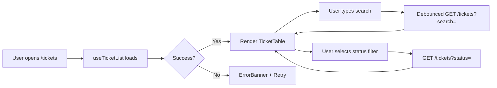
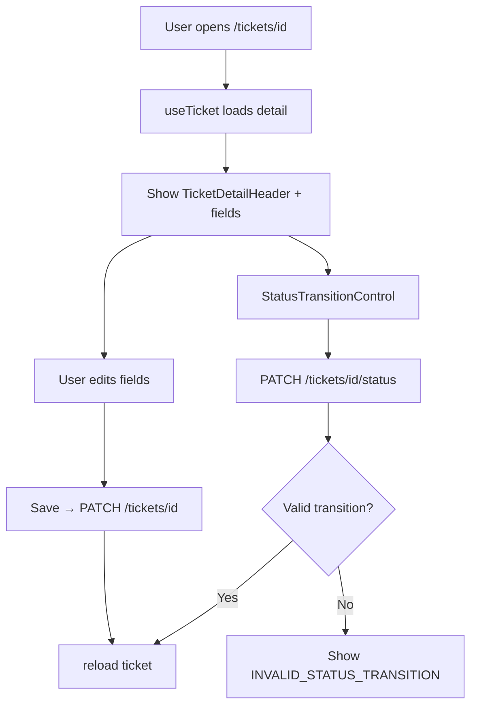
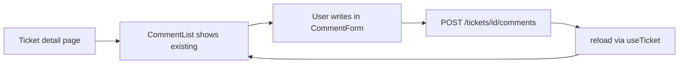

# UI Flow

**Application:** Support Ticket Management System (Core)  
**Frontend:** Next.js App Router at `http://localhost:3000`  
**No authentication** — "Acting as" user selector in header

---

## Global Layout

```
┌─────────────────────────────────────────────────────────┐
│  Header: App title · Nav (Tickets) · Acting as [▼]      │
├─────────────────────────────────────────────────────────┤
│                                                         │
│                    Page content                         │
│                                                         │
└─────────────────────────────────────────────────────────┘
```

- **Acting user** persists in `localStorage`
- Pre-fills creator on create form and author on comment form

---

## Route Map

| Route | View component | Primary APIs |
|-------|----------------|--------------|
| `/` | Redirect | → `/tickets` |
| `/tickets` | `TicketListView` | `GET /tickets`, `GET /users` |
| `/tickets/new` | `CreateTicketView` | `GET /users`, `POST /tickets` |
| `/tickets/[id]` | `TicketDetailView` | `GET /tickets/:id`, `PATCH /tickets/:id`, `PATCH /tickets/:id/status`, `POST /tickets/:id/comments` |

---

## Flow 1: Browse and Search Tickets



**UI elements:** `TicketFilters`, `TicketTable`, priority/status badges  
**Loading:** spinner while `useTicketList` is loading  
**Empty state:** shown when no tickets match

---

## Flow 2: Create Ticket

```mermaid
flowchart LR
    A[User clicks New Ticket] --> B[/tickets/new]
    B --> C[TicketForm loads users]
    C --> D[User fills fields]
    D --> E{Client valid?}
    E -->|No| F[Disabled submit + hints]
    E -->|Yes| G[POST /tickets]
    G --> H{Success?}
    H -->|Yes| I[Redirect to /tickets/id]
    H -->|No| J[Show API error]
```

**Defaults:** `createdById` from acting user  
**Server:** status always `OPEN`

---

## Flow 3: View and Edit Ticket



**Edit scope:** title, description, priority, assignee — not status via PATCH  
**Status:** dropdown shows only allowed next statuses from `lib/status-machine.ts`

---

## Flow 4: Add Comment



**Author:** pre-filled from acting user; overridable in form

---

## Error and Loading States

| Scenario | UI behavior |
|----------|-------------|
| Initial page load | `LoadingSpinner` in view or `app/loading.tsx` at route level |
| API failure | `ErrorBanner` with message + retry (`reload()`) |
| Validation error | Inline field errors; `aria-invalid` / `aria-describedby` |
| Invalid status transition | Error message from API displayed in detail view |
| Uncaught render error | `app/error.tsx` boundary with link back to `/tickets` |

---

## Screenshots

| Screen | File |
|--------|------|
| Ticket list | `docs/screenshots/ticket-list.png` |
| Create ticket | `docs/screenshots/create-ticket.png` |
| Ticket details | `docs/screenshots/ticket-details.png` |
| Status transition | `docs/screenshots/status-transition.png` |
| Comments | `docs/screenshots/comments.png` |

---

## Intentionally Excluded UI (Stretch)

- Login / logout
- User management screens
- Dashboard (removed during polish; `/` redirects to list)
- Pagination controls
